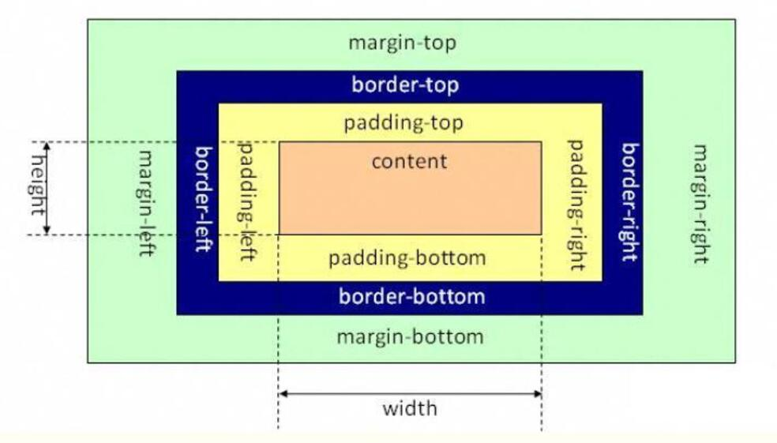

###盒子模型
盒子模型有两种,分别是**IE盒子模型**和**标准W3C盒子模型**.
***
**标准W3C盒子模型**的范围包括margin,border,padding,content,并且content部分不包含其他部分.

***
**IE盒子模型**的范围也包括margin,border,padding,content,但与标准W3C不同的是IE盒子模型的content部分包含了border和padding.

***
那应该选择哪种盒子模型呢？当然是“标准 W3C 盒子模型”了。怎么样才算是选择了“标准 W3C 盒子模型”呢？
很简单，就是在网页的顶部加上 DOCTYPE 声明。如果不加 DOCTYPE 声明，那么各个浏览器会根据自己的行为去理解网页，即 IE 浏览器会采用 IE 盒子模型去解释你的盒子，而 FF 会采用标准 W3C 盒子模型解释你的盒子，所以网页在不同的浏览器中就显示的不一样了。反之，如果加上了 DOCTYPE 声明，那么所有浏览器都会采用标准 W3C 盒子模型去解释你的盒子，网页就能在各个浏览器中显示一致了。
***
Box-sizing是CSS3的Box属性之一，那他当然也遵循CSS的Box model原理
```box-sizing: content-box|border-box|inherit;```
CSS3中的box-sizing属性的值有3种
***
```box-sizing:inherit;```
inherit规定应从父元素继承 box-sizing 属性的值。
***
```box-sizing:content-box```
box-sizing的默认属性值:content-box的width的大小只是content的大小
***
```box-sizing:border-box```
border-box的width的大小是border以内的,即content+padding+border
***
**注:offsetWidth的大小: content+padding+border**

